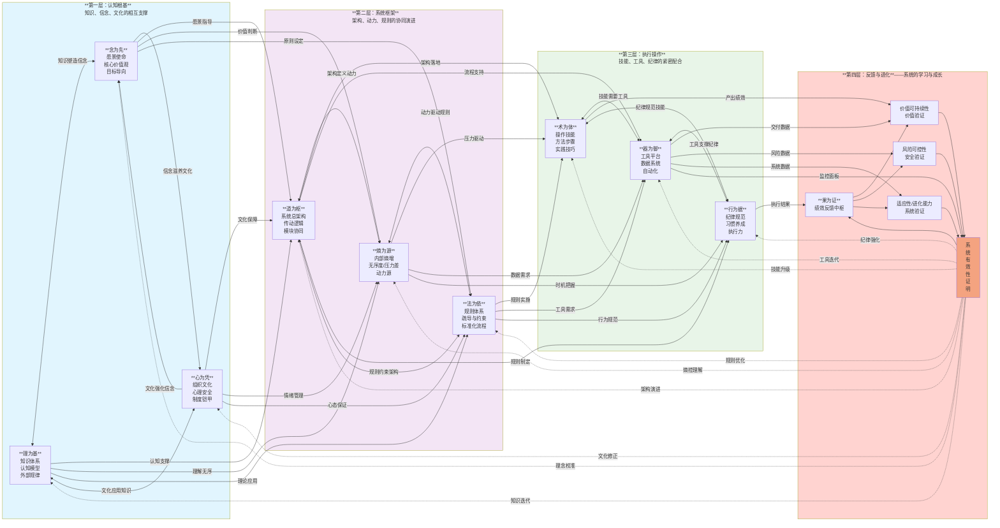

```mermaid
flowchart LR
    %% ========== 第一层：认知根基 ==========
    subgraph L1 [**第一层：认知根基**<br/>知识、信念、文化的相互支撑]
        direction LR
        A1["**理为基**<br/>知识体系<br/>认知模型<br/>外部规律"]
        A2["**念为先**<br/>愿景使命<br/>核心价值观<br/>目标导向"]
        A3["**心为凭**<br/>组织文化<br/>心理安全<br/>制度铠甲"]
        
        A1 <-->|知识塑造信念| A2
        A2 -->|信念滋养文化| A3
        A3 -->|文化强化信念| A2
        A3 <-->|文化应用知识| A1
    end

    %% ========== 第二层：系统框架 ==========
    subgraph L2 [**第二层：系统框架**<br/>架构、动力、规则的协同演进]
        direction TB
        B1["**道为枢**<br/>系统总架构<br/>传动逻辑<br/>模块协同"]
        B2["**熵为源**<br/>内部熵增<br/>无序度/压力差<br/>动力源"]
        B3["**法为依**<br/>规则体系<br/>疏导与约束<br/>标准化流程"]
        
        B1 <-->|架构定义动力| B2
        B2 <-->|动力驱动规则| B3
        B3 <-->|规则约束架构| B1
    end

    %% ========== 第三层：执行操作 ==========
    subgraph L3 [**第三层：执行操作**<br/>技能、工具、纪律的紧密配合]
        direction LR
        C1["**术为体**<br/>操作技能<br/>方法步骤<br/>实践技巧"]
        C2["**器为御**<br/>工具平台<br/>数据系统<br/>自动化"]
        C3["**行为据**<br/>纪律规范<br/>习惯养成<br/>执行力"]
        
        C1 <-->|技能需要工具| C2
        C2 <-->|工具支撑纪律| C3
        C3 <-->|纪律规范技能| C1
    end

    %% ========== 第四层：反馈与进化 ==========
    subgraph D [**第四层：反馈与进化**——系统的学习与成长]
        direction LR
        D1["**果为证**<br/>绩效反馈中枢"]
        D2["价值可持续性<br/>价值验证"]
        D3["风险可控性<br/>安全验证"]
        D4["适应性/进化能力<br/>系统验证"]
        D5["系<br/>统<br/>有<br/>效<br/>性<br/>证<br/>明"]
    end

    %% ========== 层间正向关联 ==========
    A1 -->|认知支撑| B1
    A2 -->|愿景指导| B1
    A3 -->|文化保障| B1
    
    A1 -->|理解无序| B2
    A2 -->|价值判断| B2
    A3 -->|情绪管理| B2
    
    A1 -->|理论应用| B3
    A2 -->|原则设定| B3
    A3 -->|心态保证| B3
    
    B1 -->|架构落地| C1
    B2 -->|压力驱动| C1
    B3 -->|规则实施| C1
    
    B1 -->|流程支持| C2
    B2 -->|数据需求| C2
    B3 -->|工具需求| C2
    
    B1 -->|规则制定| C3
    B2 -->|时机把握| C3
    B3 -->|行为规范| C3
    
    C1 -->|产出绩效| D2
    C2 -->|交付数据| D2
    C2 -->|风险数据| D3
    C2 -->|系统数据| D4
    C2 -->|监控面板| D5
    C3 -->|执行结果| D1

    D1 --> D2 --> D5 --> D1
    D1 --> D3 --> D5
    D1 --> D4 --> D5

    %% ========== 反馈循环 ==========
    D5 -.->|知识迭代| A1
    D5 -.->|理念校准| A2
    D5 -.->|文化修正| A3
    
    D5 -.->|架构演进| B1
    D5 -.->|熵控理解| B2
    D5 -.->|规则优化| B3
    
    D5 -.->|技能升级| C1
    D5 -.->|工具迭代| C2
    D5 -.->|纪律强化| C3

    style L1 fill:#e1f5fe
    style L2 fill:#f3e5f5
    style L3 fill:#e8f5e8
    style D fill:#ffd3d0
    style D5 fill:#f4a380
```