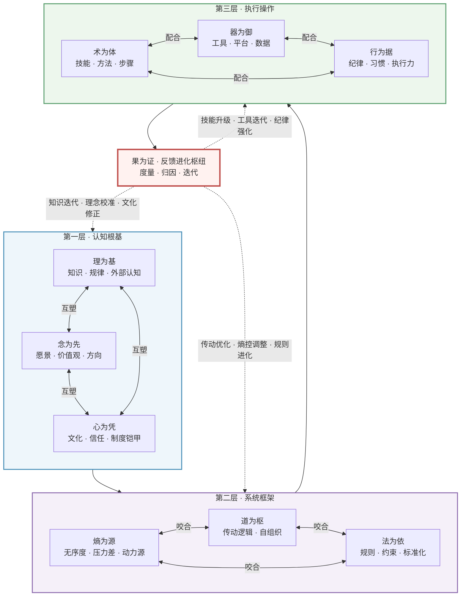

```mermaid
flowchart TB
    %% ========== 第一层：认知根基 ==========
    subgraph L1["第一层 · 认知根基"]
        direction TB
        A1["理为基<br/>知识 · 规律 · 外部认知"]
        A2["念为先<br/>愿景 · 价值观 · 方向"]
        A3["心为凭<br/>文化 · 信任 · 制度铠甲"]
        A1 <-- "互塑" --> A2
        A2 <-- "互塑" --> A3
        A3 <-- "互塑" --> A1
    end

    %% ========== 第二层：系统框架 ==========
    subgraph L2["第二层 · 系统框架"]
        direction LR
        B1["熵为源<br/>无序度 · 压力差 · 动力源"]
        B2["道为枢<br/>传动逻辑 · 自组织"]
        B3["法为依<br/>规则 · 约束 · 标准化"]
        B1 <-- "咬合" --> B2
        B2 <-- "咬合" --> B3
        B3 <-- "咬合" --> B1
    end

    %% ========== 第三层：执行操作 ==========
    subgraph L3["第三层 · 执行操作"]
        direction LR
        C1["术为体<br/>技能 · 方法 · 步骤"]
        C2["器为御<br/>工具 · 平台 · 数据"]
        C3["行为据<br/>纪律 · 习惯 · 执行力"]
        C1 <-- "配合" --> C2
        C2 <-- "配合" --> C3
        C3 <-- "配合" --> C1
    end

    %% ========== 第四层：反馈进化 ==========
    D["果为证 · 反馈进化枢纽<br/>度量 · 归因 · 迭代"]

    %% ========== 层间正向关联（简化集束） ==========
    L1 --> L2
    L2 --> L3
    L3 --> D

    %% ========== 反馈闭环 ==========
    D -. "知识迭代 · 理念校准 · 文化修正" .-> L1
    D -. "传动优化 · 熵控调整 · 规则进化" .-> L2
    D -. "技能升级 · 工具迭代 · 纪律强化" .-> L3

    %% ========== 样式 ==========
    style L1 fill:#eef6fb,stroke:#4a90b8,stroke-width:2px
    style L2 fill:#f5f0f9,stroke:#8e6caf,stroke-width:2px
    style L3 fill:#edf7ed,stroke:#5a9e6e,stroke-width:2px
    style D fill:#fff2f0,stroke:#c0504d,stroke-width:3px
```
